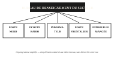

# FICHE ORGANIQUE — DISPOSITIF DE RENSEIGNEMENT DU SECTEUR

**Réf. FO-118 — Dernière mise à jour d'ensemble : il y a 6 mois**

Cette fiche recense les cinq éléments officiellement rattachés au dispositif de renseignement du secteur, leur portée déclarée et leur rythme de compte-rendu attendu en fonctionnement normal. Elle ne renseigne pas sur l'état actuel de chaque source : pour cela, consulter le dernier rapport ou l'historique de chacune.

 **Poste d'observation fixe Nord.** Poste fixe équipé d'une optique longue portée, couvrant l'axe nord sur 8 km. En configuration normale, il transmet un compte-rendu toutes les 30 minutes. Il est placé sous la responsabilité du chef de poste en rotation, et sa fiche a été révisée il y a 6 mois.

 **Écoute radio et interception.** Deux stations d'écoute fixes, désignées A et B, branchées sur le même flux de collecte, couvrant l'ensemble des fréquences militaires connues du secteur. Le dispositif fonctionne en continu, avec une synthèse consolidée transmise toutes les heures par l'officier transmissions en poste. Fiche révisée il y a 3 mois.

 **Informateur local.** Contact humain rémunéré, couvrant l'axe secondaire et le village voisin, sur sollicitation et sans cadence fixe. Recruté il y a 3 mois par l'officier traitant (identité protégée), il n'a fait l'objet d'aucune réévaluation de fiabilité depuis son recrutement.

 **Poste frontalier allié.** Poste fixe partenaire situé dans le secteur adjacent, avec lequel un échange de renseignement de routine a lieu toutes les heures, par l'intermédiaire du contact de liaison allié. Fiche révisée il y a 1 an.

 **Patrouille avancée.** Unité mobile chargée de la reconnaissance du secteur, dont le rythme de compte-rendu varie à chaque étape de mission selon le terrain parcouru, sous la responsabilité du chef de patrouille. Sa fiche de mission a été mise à jour il y a 20 jours.

> Note : la fréquence de compte-rendu nominale indique le rythme attendu en fonctionnement normal ; elle ne préjuge pas du rythme réellement observé sur cette mission. Pour le vérifier source par source, consulter l'historique des dernières 24 h.

## Organigramme du dispositif

Les cinq éléments sont rattachés au même bureau de renseignement et ne dépendent pas les uns des autres : la défaillance ou le silence de l'un ne renseigne pas automatiquement sur l'état des quatre autres.

---

*Note administrative : la présente fiche reprend la trame standard utilisée depuis l'exercice CENTAURE de l'année précédente ; seules les données propres au secteur actuel ont été mises à jour.*

*Pièce n° 1 du dossier initial*
