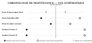

 

# CALENDRIER DE MAINTENANCE — POSTES D'OBSERVATION DU SECTEUR

**Service technique — extrait valable pour l'ensemble des postes fixes et stations d'écoute**

Le service technique effectue une rotation mensuelle des contrôles d'alimentation électrique sur les postes fixes, et une rotation trimestrielle des contrôles électroniques sur les stations d'écoute. Le poste frontalier allié a été contrôlé il y a 3 semaines et sa prochaine intervention est programmée dans 5 semaines ; le poste d'observation Est, hors secteur, a été contrôlé il y a 1 semaine pour une prochaine intervention dans 3 semaines. Les deux stations d'écoute A et B suivent le même rythme trimestriel, contrôlées il y a 6 semaines pour une prochaine intervention dans 6 semaines. Le poste d'observation fixe Nord figure sur ce calendrier, mais ni sa dernière date d'intervention ni la prochaine ne sont communiquées à ce niveau.

Les dates de maintenance des postes d'observation ne sont pas systématiquement communiquées au niveau de ce bureau. Pour toute confirmation d'une intervention réalisée sur un poste précis, consulter le journal des incidents du poste concerné.

---

*Pièce n° 7 du dossier initial — Séquence 0. À trier : utile, sans rapport, ou ambiguë.*
